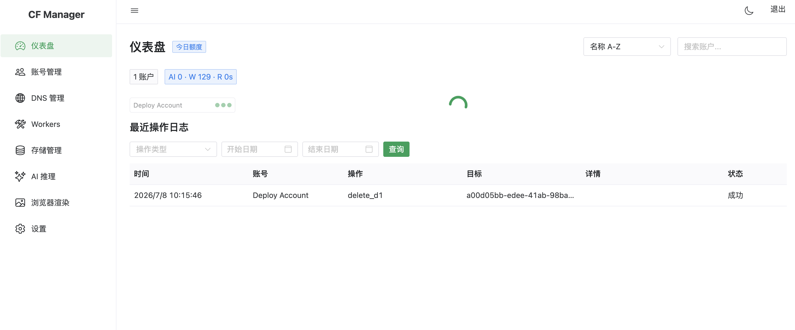
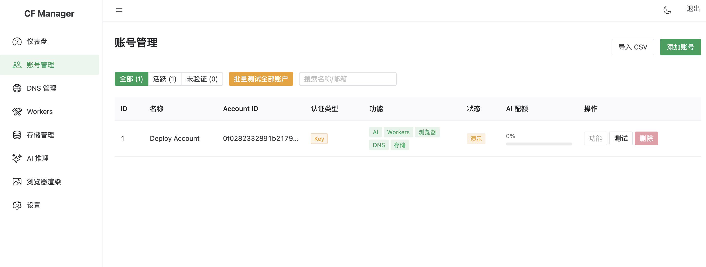
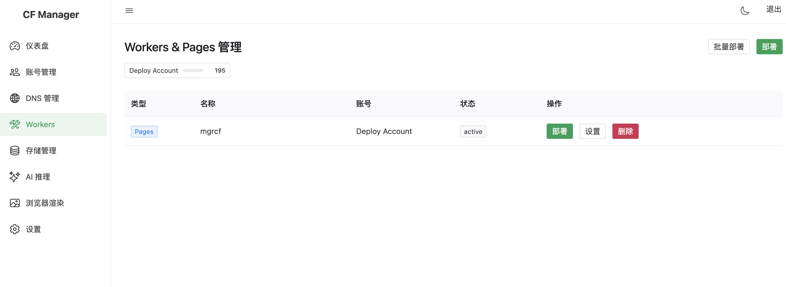
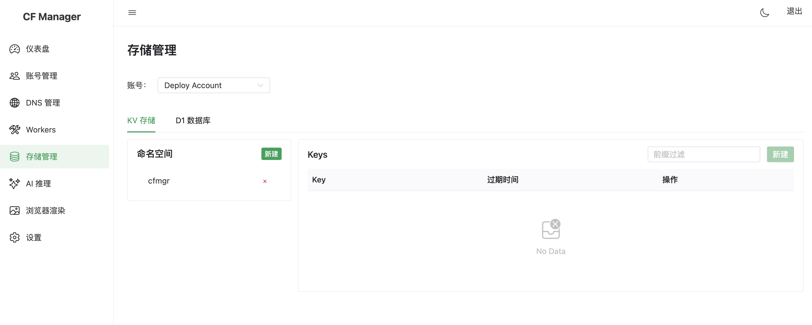
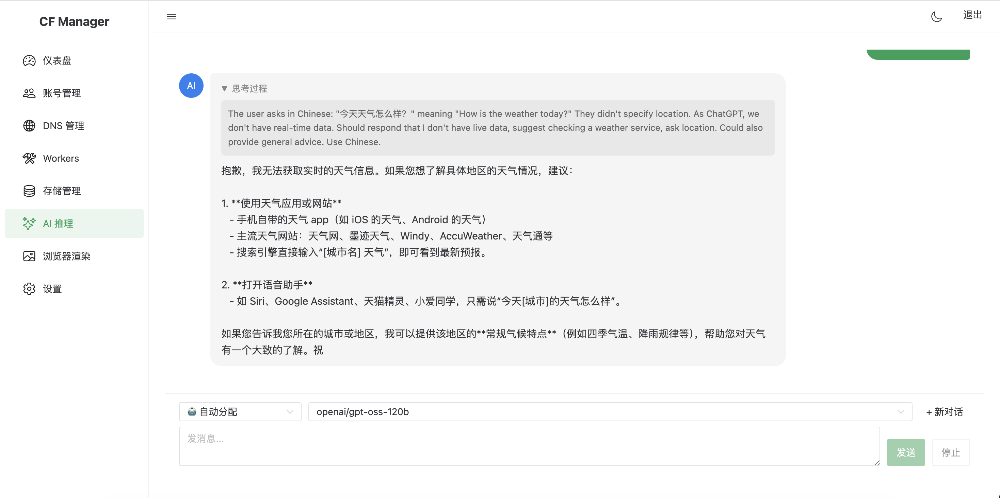
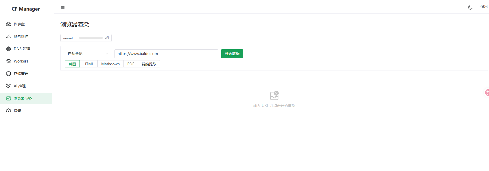
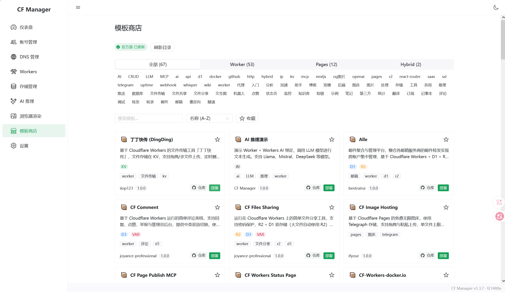
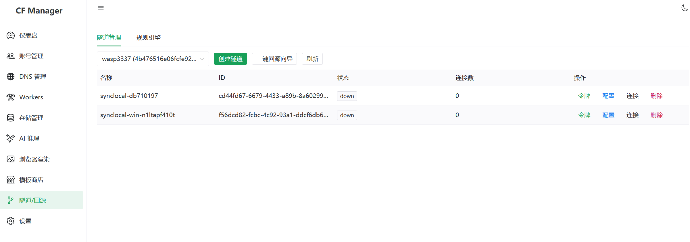
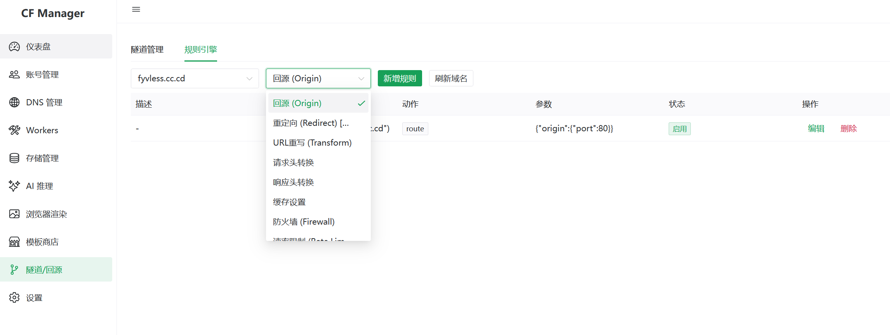

# CF Manager

> ## ⚠️ 免责声明与合规提示
>
> 本工具仅供**学习、技术研究与已授权账户的自有运维管理**使用。使用本项目产生的任何账号封禁、IP 封禁、费用或其他后果，均由使用者自行承担，与本开源项目及作者无关。
>
> - 请严格遵守 [Cloudflare 服务条款（含 Acceptable Use）](https://www.cloudflare.com/terms/)，**禁止**将本项目用于对外提供公共 AI / 渲染中转服务、转售或分摊算力等违反条款的行为。
> - 仅添加你本人或已明确授权的 Cloudflare 账户，不使用任何未授权账户。
> - 多账户切换、自动配额切换等能力**仅限本人合法授权的多个自有账户**使用；批量挂载账号以自动分摊 AI 配额可能违反 Cloudflare 服务协议，不建议开启。
> - 控制调用频率，避免批量、自动化过量请求触发风控或封号。
> - 浏览器渲染等涉及外部 URL 的功能，请仅用于可信来源，防范 SSRF 与内网探测。
> - 如对相关功能是否符合 Cloudflare 服务条款存疑，请优先参考官方条款并咨询法律意见。

CF Manager 是面向开发者 / 运维的一站式 Cloudflare 多账户统一运维管理平台，解决多账号频繁切换后台、资源批量运维繁琐的问题。

支持可视化管理域名 DNS、Workers、Pages 与 KV/D1/R2 存储，附带内置 AI 推理、网页渲染的本地调试能力，并提供**仅限内网本地使用**的 OpenAI 兼容适配接口。

## 在线演示

| | |
|---|---|
| 地址 | [https://mgrcf.pages.dev/admin/](https://mgrcf.pages.dev/admin/) |
| 密码 | `cfmgrbest` |

> 演示站部署在 Cloudflare Pages + D1，无需 Docker。根路径显示伪装的 nginx 欢迎页，管理界面通过 `/admin/` 访问。
>
> ⚠️ 演示站绑定的是**专用演示账户**，所有功能均可体验但配额有限，仅供界面与功能演示，**请勿用于真实业务或批量调用**；该账户为公开共享演示账号，滥用可能导致其被 Cloudflare 限流或封禁。

## 功能特性

| 模块 | 核心能力 |
|---|---|
| **多账户管理** | API Token / Global API Key 双认证 · 凭证 AES 加密 · 多账户统一切换 ([认证文档](docs/account-auth.md)) |
| **仪表盘** | 各账户配额用量实时展示（Workers、AI、渲染）· 可视化进度条 · 操作审计 |
| **Workers / Pages** | 脚本/项目 CRUD · 单/跨账户批量部署 · 绑定/环境变量/路由/自定义域名 · Pages 回滚 |
| **DNS 管理** | A/AAAA/CNAME/MX/TXT 记录管理 · 一键代理开关 · 批量操作 |
| **隧道管理** | Tunnel 创建/删除 · Ingress 可视化编辑（域名↔服务映射）· 一键回源向导（DNS CNAME + ingress 自动配置） |
| **规则引擎** | 8 种规则类型（回源、URL 重写、请求/响应头转换、缓存、防火墙、限速、重定向）· 结构化表单+高级模式 · 表达式生成器 |
| **存储管理** | KV 键值 CRUD · D1 数据库 SQL 查询 + 表结构变更 · R2 文件上传/下载/预览 |
| **AI 推理** | Workers AI 全模型 · Prompt Caching 感知计费 · 流式对话 + Reasoning 可视化 · 历史上下文 · 多账户调度 |
| **浏览器渲染** | 截图 / HTML / Markdown / PDF / 链接提取 5 种模式 · 限速+配额管理 · SSRF 防护 |
| **OpenAI 兼容 API** | `/v1/chat/completions`、`/v1/models`、浏览器渲染接口 · 流式+非流式 · 仅限内网本地调试 ([API 文档](docs/api-v1.md)) |
| **应用商店** | 内置 Catalog 模板市场 · 第三方源扩展 · 一键部署 Workers/Pages |
| **系统设置** | HTTP/SOCKS5 代理 · 缓存清除 · 定时任务扩展 |
| **安全特性** | API Token AES 加密 · 可选登录密码 · `/admin/` 路径隐藏 + nginx 伪装 · 审计日志 |

---

## 快速开始

> 三种部署方式可选，详见 [部署文档](docs/deploy.md)

<details open>
<summary><strong>方式一：Fork 一键部署（最简单）</strong></summary>

无需安装任何工具，全程在浏览器中完成。

**推荐：使用 Secrets 版本（敏感信息不泄露到日志）**

1. **Fork 本仓库** → 点击右上角 Fork
2. 进入 Fork 仓库 → **Settings** → **Environments** → **New environment**，创建环境（如 `production`），在环境内添加 4 个 secret：
   - `CF_API_KEY`：Cloudflare Global API Key（高权限密钥，建议改用细粒度 API Token，见 [账户认证文档](docs/account-auth.md)）
   - `CF_EMAIL`：Cloudflare 账号邮箱
   - `ENCRYPTION_KEY`：加密密钥（请填写高强度随机字符串，至少 16 位）
   - `API_SECRET`：管理界面访问密码（请填写高强度随机字符串，不要使用弱密码）
3. 进入 **Actions** → 选择 **Deploy to Cloudflare Pages (Secrets)** → **Run workflow**，输入环境名如 `production`
4. 等待部署完成，访问 `https://cfmgr.pages.dev/admin/`

> ⚠️ 重要提醒：仅建议绑定本人独立业务 / 测试账号分开管理，请勿批量挂载账号用于自动分摊 AI 配额，该用法违反 Cloudflare 服务协议。

> 多账户可建多个 Environment 分别配密钥，部署时输入对应环境名即可。

> Cloudflare Global API Key 获取：[Cloudflare Dashboard](https://dash.cloudflare.com/profile/api-tokens) → API Keys → Global API Key → View

</details>

<details>
<summary><strong>方式二：Cloudflare Pages 手动部署（零成本）</strong></summary>

下载预构建包上传到 Cloudflare Dashboard。

**1. 下载部署包：**

👉 [下载最新版 cf-manager.zip](https://github.com/hefy2027/cf-manager/releases/latest/download/cf-manager.zip)

或本地构建：`cd worker && npm install && npm run build`

**2. 创建 D1 数据库：**

Cloudflare Dashboard → Workers & Pages → D1 → Create → 名称填 `cf-manager` → 在 Console 中执行 `worker/src/db/schema.sql`

**3. 上传部署：**

Workers & Pages → Create → Pages → Upload assets → 上传 `cf-manager.zip`

**4. 配置 Bindings：**

Settings → Bindings → Add D1 Database → Variable name: `DB` → 选择你的数据库

Settings → Bindings → Add KV Namespace → Variable name: `KV` → 创建或选择已有的命名空间

Settings → Environment variables → 添加 `ENCRYPTION_KEY` 和 `API_SECRET`（可选）

**5. 重新部署后访问** `https://your-project.pages.dev/admin/`

</details>

<details>
<summary><strong>方式三：Docker 部署（自建服务器）</strong></summary>

```bash
# 1. 克隆项目
git clone https://github.com/hefy2027/cf-manager.git
cd cf-manager

# 2. 创建配置文件
cp .env.example .env

# 3. 编辑 .env，至少设置 ENCRYPTION_KEY
#    可选设置 API_SECRET（管理界面登录密码）、PROXY_URL（代理地址）
#    可选设置 BASE_URL（前端访问路径，如 /admin/）

# 4. 一键部署
chmod +x deploy.sh
./deploy.sh

# 5. 访问 http://localhost:3000（或 http://localhost:3000/admin/ 如果设置了 BASE_URL）
```

</details>

### 环境变量

| 变量 | 必填 | 说明 |
|---|---|---|
| `ENCRYPTION_KEY` | 是 | 加密存储 API Token 的密钥（任意随机字符串，至少 16 位） |
| `API_SECRET` | 否 | 管理界面访问密码，留空则无需登录 |
| `PROXY_URL` | 否 | HTTP/SOCKS5 代理地址，如 `http://127.0.0.1:7890` 或 `socks5://127.0.0.1:1080` |
| `APP_PORT` | 否 | 对外暴露端口，默认 `3000` |
| `BASE_URL` | 否 | 前端访问路径，如 `/admin/`，默认 `/`（仅 Docker 部署需要，Worker 版固定为 `/admin/`） |
| `DEMO_ACCOUNT_IDS` | 否 | 演示模式保护的账户 ID（逗号分隔），如 `1,2,3`。受保护账户不可删除和修改 |
| `KV` (Binding) | 否 | KV Namespace 绑定（仅 Pages 部署），用于并发请求保护和缓存感知路由。可选但推荐 |

<details>
<summary><strong>本地开发</strong></summary>

```bash
# 后端（http://localhost:3001）
cd backend
npm install
ENCRYPTION_KEY="dev-key" npm run dev

# 前端（http://localhost:5173，自动代理 /api 到后端）
cd frontend
npm install
npm run dev
```

</details>

---

## 技术栈

| 层级 | Docker 版 | Worker 版 |
|---|---|---|
| 前端 | Vue 3 + Naive UI + Pinia | 同左 |
| 后端 | Express 5 + Cloudflare SDK | Hono + Cloudflare REST API |
| 数据库 | SQLite (better-sqlite3) | Cloudflare D1 |
| 部署 | Docker Compose | Cloudflare Pages |

---

## 项目结构

```
cf-manager/
├── backend/                 # 后端 API 服务
│   └── src/
│       ├── index.ts         # Express 入口
│       ├── config.ts        # 配置
│       ├── db.ts            # SQLite 数据库
│       ├── middleware/      # 认证、错误处理、响应包装
│       ├── models/          # 数据模型
│       ├── routes/          # API 路由
│       └── services/        # 业务逻辑层（Cloudflare SDK 封装）
├── frontend/                # 前端 Vue 应用
│   └── src/
│       ├── api/             # API 调用封装
│       ├── views/           # 页面组件
│       ├── components/      # 可复用组件（StoreDeployDialog 等）
│       ├── stores/          # Pinia 状态管理
│       └── utils/           # 工具函数
├── worker/                  # Cloudflare Pages 部署版
│   ├── src/                 # Hono API 路由 + D1 模型
│   ├── build.js             # 一键构建脚本
│   └── wrangler.toml        # Wrangler 配置
├── docker/                  # Docker 构建配置
│   ├── backend/Dockerfile
│   └── frontend/
│       ├── Dockerfile
│       ├── nginx.conf.template  # Nginx 配置模板（支持 BASE_URL）
│       └── entrypoint.sh        # 容器启动脚本
├── shared/                  # 前后端共享配置
│   ├── model-pricing.json    # AI 模型定价（含缓存价格）
│   ├── catalog.schema.json   # Catalog 模板 JSON Schema
│   └── catalogValidator.ts   # Catalog 校验器源码
├── docs/                    # 文档
│   ├── api-v1.md            # 外部 API 接口文档
│   ├── account-auth.md      # 账户认证方式说明
│   └── deploy.md            # 部署文档
├── docker-compose.yml
├── deploy.sh                # 一键部署脚本
├── CHANGELOG.md             # 更新日志
└── .env.example             # 环境变量模板
```

---

## 功能截图

<table>
  <tr>
    <td width="33%"><br><em>仪表盘</em></td>
    <td width="33%"><br><em>账号管理</em></td>
    <td width="33%"><br><em>Workers / Pages</em></td>
  </tr>
  <tr>
    <td><br><em>DNS 管理</em></td>
    <td><br><em>存储管理（KV / D1 / R2）</em></td>
    <td><br><em>AI 推理</em></td>
  </tr>
  <tr>
    <td><br><em>浏览器渲染</em></td>
    <td><br><em>系统设置</em></td>
    <td><br><em>应用商店</em></td>
  </tr>
  <tr>
    <td><br><em>隧道管理</em></td>
    <td><br><em>规则引擎</em></td>
    <td></td>
  </tr>
</table>

---

## Star History

[](https://star-history.com/#hefy2027/cf-manager&Date)

## License

[MIT](LICENSE) © 2024 CF Manager Contributors


## 相关项目

- [cf-store](https://github.com/hefy2027/cf-store)：CF Manager「应用商店」的 Catalog 模板仓库（应用/Worker 部署模板源），如需贡献或自托管模板可参考此仓库。

## 社区

本开源项目已链接并认可 [LINUX DO 社区](https://linux.do)。
